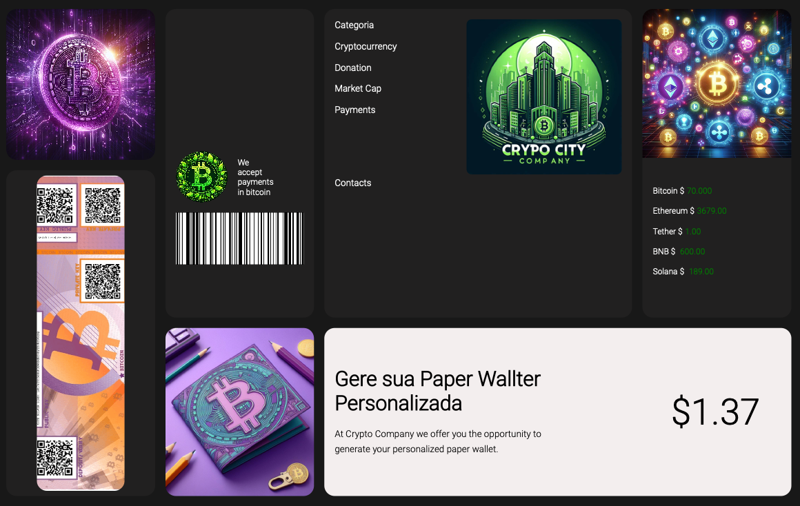

<h1 align="center"> Paper wallet generator </h1>

  <a href="#-tecnologias">Tecnologias</a>&nbsp;&nbsp;&nbsp;|&nbsp;&nbsp;&nbsp;
  <a href="#-projeto">Projeto</a>&nbsp;&nbsp;&nbsp;|&nbsp;&nbsp;&nbsp;
  <a href="#memo-licença">Licença</a>

  

 

  

## 🚀 Tecnologias

This project was developed with technologies:

- HTML
- CSS
- Git e Github

## 💻 Projeto

 This project aims to develop a paper wallet generator for cryptocurrencies. The idea is to allow users to generate paper wallets for different types of cryptocurrencies in a  secure and efficient way.
 
**landing page to practice CSS Grid and Flex

## :memo: Licença

This project is under the MIT license.

---
